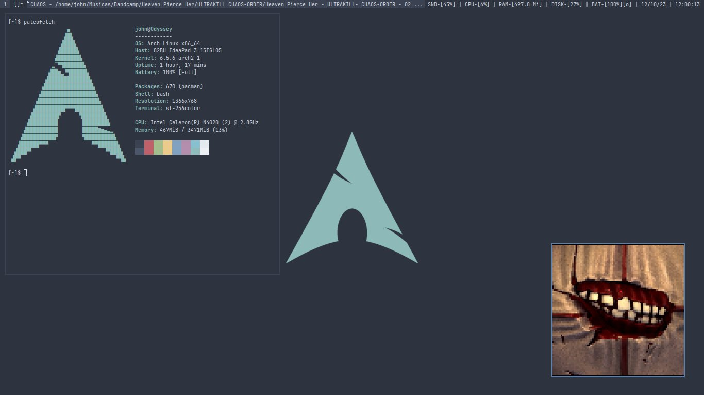

# Setup Suckless  
Este repositório está o meu setup com ferramentas suckless, junto de alguns scripts.

### Programas utilizados no setup (fora os do próprio repositório):  
- Librewolf
- sx
- xrdb
- setxkbmap
- ffmpeg
- cmus
- alsa-utils
- brightnessctl
- NetworkManager

### Preview
